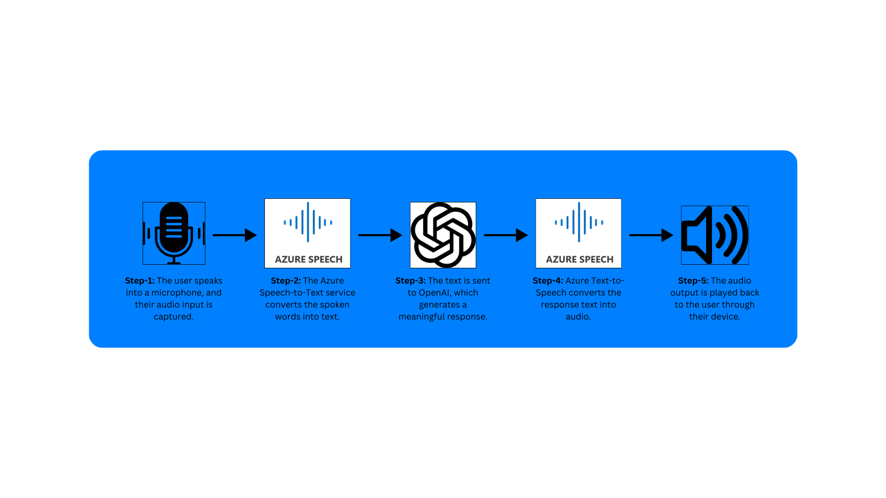

# SpeakMate: Virtual Companion Assistant

🎙️ **SpeakMate** is a next-generation virtual companion assistant designed to enable seamless two-way conversations. The project leverages Azure Cognitive Services and OpenAI to provide real-time, intelligent, and natural-sounding interactions. 

---

## Table of Contents
1. [Project Overview](#project-overview)
2. [Features](#features)
3. [Architecture](#architecture)
4. [Setup Instructions](#setup-instructions)

---

## Project Overview

**SpeakMate** serves as a personal AI assistant capable of understanding user speech, generating intelligent responses, and delivering them as natural-sounding audio. The assistant is designed for real-time communication, creating a conversational experience that mimics human interaction.

Key Use Cases:
- Personal AI assistant for task reminders or FAQs.
- AI companion for mental health support.
- Customer support for businesses.

---

## Features

- **Speech-to-Text Conversion**: Accurate voice-to-text transcription using Azure Speech Services.
- **AI-Driven Conversations**: Intelligent responses generated using OpenAI GPT models hosted on Azure.
- **Text-to-Speech Conversion**: High-quality, natural voice synthesis with Azure Text-to-Speech.
- **Real-Time Interaction**: Provides continuous two-way conversations with autoplay features.
- **Streamlit Web Interface**: User-friendly and responsive interface for seamless communication.

---

## Architecture

### Key Components:

1. **User Input (Microphone)**: Captures user speech.
2. **Azure Speech-to-Text**: Converts spoken input into textual form.
3. **OpenAI GPT (Deployed on Azure)**: Generates contextual responses.
4. **Azure Text-to-Speech**: Converts text responses into human-like speech.
5. **Output (Speaker)**: Plays back the audio response.
6. **Streamlit Interface**: Interactive web interface for user interactions.

---

## Setup Instructions

### Prerequisites

- Python 3.8 or higher
- Azure subscription for Cognitive Services and OpenAI
- Streamlit installed
